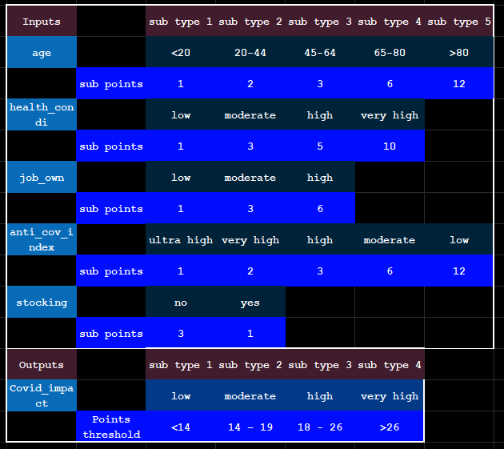

# tmcovid
Using Tsetlin Machine to Model Social Distancing and its Impact on Spreading COVID-19


## The Forming of Dataset

### --- Inputs and Outputs --- 
There are 5 types of inputs: 

1) age, 

2) health_condi, 
   
3) job_own, 
   
4) anti_cov_index, 

5) stocking 

which are

1) the age of the person, 
2) the underline heath condition of the person, 
3) to what extent the job of this person has involve with close contact with other people, 
4) the effectiveness of the  government's combat COVID19 policy and how does this person implemented them, 
5) does this person need to do regular shopping because lack of food stocking 
   

Each input has multiple sub-types which are:

1) <40, 45 - 64, 65 - 80, >80
2) low,	moderate,	high,	very high
3) low,	moderate,	high
4) ultra high,	very high,	high,	moderate,	low 
5) no, yes

The output are probability of fatal impact to the person which has 5 sub-types which are:

very low,	low,	moderate,	high,	very high


### --- Weights of the Inputs ---
In order to generate the dataset, we need make some rough assumption to the probability of COVID19 fatal impact based on the inputs.

From the brief analyze of the growing COVID19 cases we have, the order person and people have critical underline health condition are more likely to develop critical symptom after contracting COVID19. 

In addition, most of government and medical experts believe that social distancing may reduce the possibility of people contracting the disease. 

Moreover, input 5) stocking seems has weaker connection to the possibility of COVID19 infection. 

Based on these early finding, each input may have different weight in forming the output. Therefore, a point based system can be introduced in constructing the output.

### ---- Point based System ---

If the circumstance of the person fit into a sub-type of the inputs, the corresponding point will be generated. If the total point exceeded certain threshold, the probability can be calculated. 

<!--  -->


The table shows the details of the point system in order to generate outputs.

For example, a person in his 70s with no underline heath condition and retired, strongly implementing social distancing, and well stocked food in home. 

The point of this person can be calculated as 6 + 1 + 1 + 1 + 1 = 10, thus COVID-19 has low impact to this person's life.

Another example, a person in his 20s with healthy body, no job at the moment, going to supermarket every week, but disbelieve social distancing and handing out with friends every day. 

The point of this person can be calculated as 1 + 1 + 1 + 1 + 3 + 12 = 19, thus this person more likely to be infected by COVID-19 with negative impact to this person's life. 


## pythonTM
usage: 
```
 python COVID19_00.py --state 50 --c 50 --s 1.2 --t 2 --e 1
```